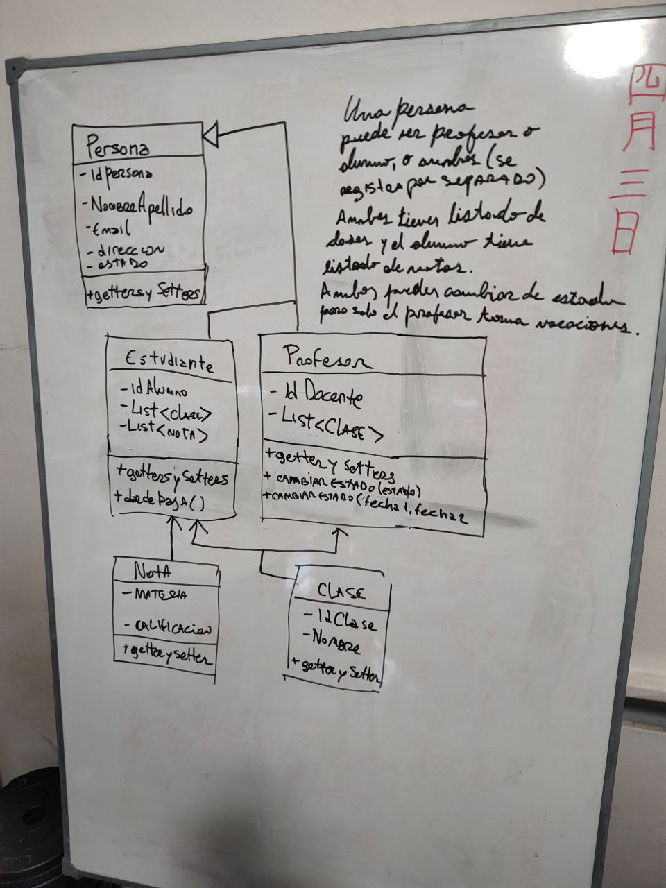

# Ejercicio universidad
**Es el segundo ejercicio** donde se plantea una clase persona y diversas clases que interaccionan entre si.
La clase Estudiante y Profesor se extienden de Persona y luego nota y clase son para almacenar que materia y que calificación tiene.

Esta primera implementación es erronea.
Se entendió mal el ejercicio.

1) **Abstracción**:
   Para poner en práctica este concepto tan importante dentro de la POO, se propone pensar en una
   clase de su entorno (familia, casa, trabajo, universidad) y definir por lo menos 2 clases. (pueden
   contener herencia o relación).
2) **Encapsulamiento**:
   Realizar un diagrama que contenga a las clases Usuarios, Roles y Estados, y a su vez, que define en
   alguna de ellas atributos públicos y privados, detallando sus respectivos métodos (Getters y Setters).
3) **Polimorfismo**:
   Para trabajar el concepto y entenderlo mejor, se requiere que puedan encontrar una clase de su
   entorno estudiantil (universidad, cursos, autodidacta) y definir por lo menos 2 clase con 2 métodos
   cada una.
   Utilizar el ejercicio anterior del encapsulamiento, y aplicar a la clase Usuario, dos métodos nuevos
   con los que se pueda aplicar estos conceptos

*El diagrama está incompleto, faltan partes importantes, ejemplo, instituto, comisión, clase, materia, usuario, tipo de usuario, permisos... Es una sobresimplificación pero que aplica parte de lo solicitado en la consigna.*